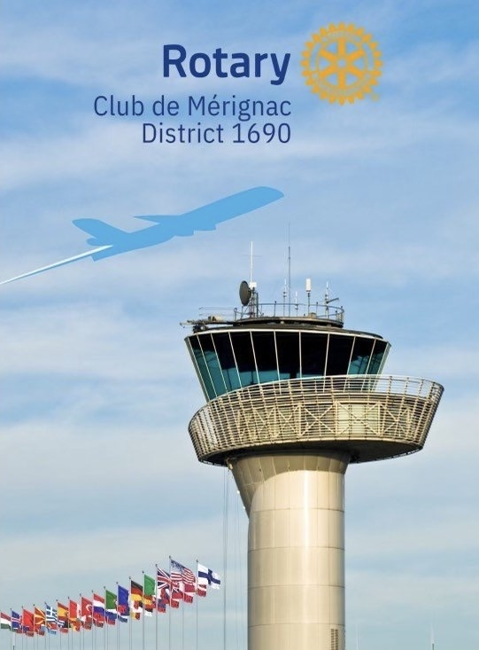
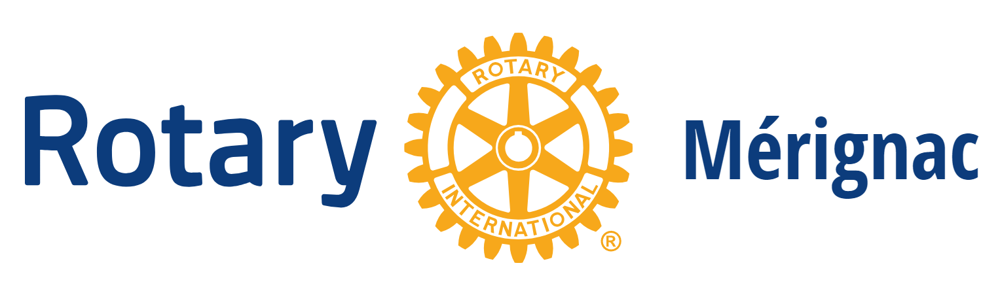

# 🌍 Rotary Mérignac - Landing Page

🚀 **Rotary Mérignac** is a dynamic and engaged community club dedicated to humanitarian service, ethical leadership, and impactful projects.  
This landing page serves as a platform to **recruit new members, promote events, and enhance community engagement** on both local and international levels.

---

## 📌 **Key Features**
✅ **Modern & Responsive Design** – Fully optimized for desktops, tablets, and mobile devices  
✅ **Event Registration System** – Integrated with **HelloAsso** for seamless sign-ups  
✅ **Social Media Integration** – Strengthening Rotary Mérignac’s digital presence  
✅ **Clear Call-to-Actions (CTAs)** – Encouraging visitors to **join, donate, or get involved**  
✅ **SEO Optimization** – Improving search engine rankings for better visibility  

---

## 🎨 **Design Preview**
📸 **Screenshots**:  
  
  

---

## 🛠 **Technologies Used**
- **React.js** – For a dynamic and modular user interface  
- **CSS3** – For a clean and modern design  
- **Vite** – For fast development and optimized builds  
- **Git & GitHub** – For version control and collaboration  

---

## 🚀 **Installation & Setup**
1️⃣ **Clone the Repository**  
```bash
git clone https://github.com/karin167/rotary-landing-page.git
