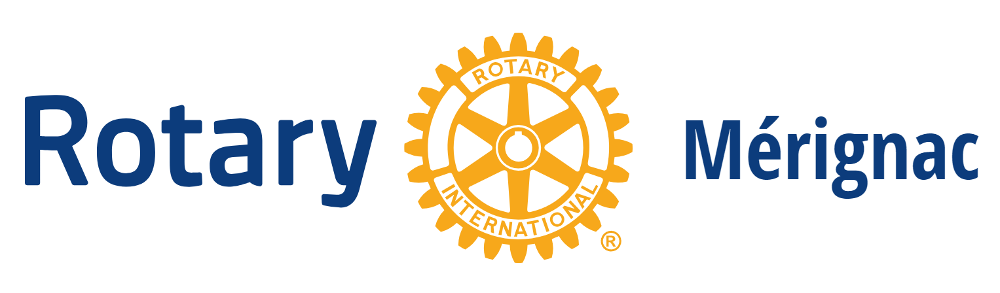

# 🌍 **Rotary Mérignac - Landing Page**  

🚀 **Rotary Mérignac** is a dynamic and engaged community club dedicated to **humanitarian service, ethical leadership, and impactful projects**.  
This landing page serves as a platform to **recruit new members, promote events, and enhance community engagement** on both local and international levels.

🔗 **Live Demo:** [Visit the Landing Page](https://rotary-landing-page.netlify.app/)  

---

## 📌 **Key Features**  
✔️ **Modern & Responsive Design** – Optimized for **desktops, tablets, and mobile devices**  
✔️ **Event Registration System** – Integrated with **HelloAsso** for seamless sign-ups  
✔️ **Social Media Integration** – Strengthening **Rotary Mérignac’s digital presence**  
✔️ **Clear Call-to-Actions (CTAs)** – Encouraging visitors to **join, donate, or get involved**  
✔️ **SEO Optimization** – Improving search engine rankings for better visibility  

---

## 🎨 **Design Preview**  
🎮 **Screenshots:**  
  
  

---

## 🛠 **Tech Stack**
🔹 **React.js** – For a dynamic and modular UI  
🔹 **Vite** – For a fast development environment  
🔹 **CSS3** – For a modern, responsive design  
🔹 **i18next** – Multi-language support for a global audience  
🔹 **Git & GitHub** – Version control and collaboration  

---

## 🚀 **Installation & Setup**
### 1️⃣ **Clone the Repository**  
```bash
git clone https://github.com/karin167/rotary-landing-page.git
cd rotary-landing-page
```

### 2️⃣ **Install Dependencies**  
```bash
npm install
```

### 3️⃣ **Run the Development Server**  
```bash
npm run dev
```
🌐 Open `http://localhost:5173/` in your browser.

---

## 🔥 **Deployment**  
This project is deployed on **Netlify**. You can also deploy it on **Vercel** or **GitHub Pages** with simple configurations.  

To deploy manually:  
```bash
npm run build
```
Then, upload the `/dist` folder to your preferred hosting service.

---

## 🤝 **Contributing**
🎯 We welcome contributions!  
If you'd like to **improve the design, add features, or fix bugs**, feel free to:  
1. Fork the repository  
2. Create a new branch: `git checkout -b feature-xyz`  
3. Commit your changes: `git commit -m "Added new feature XYZ"`  
4. Push to your branch: `git push origin feature-xyz`  
5. Submit a **Pull Request**  

---

## 💌 **Contact & Support**
📧 **Email:** contact@rotarymerignac.com  
🌎 **Website:** [Rotary Mérignac](https://www.rotarymerignac.org)  
📱 **Follow Us:** [Instagram](https://www.instagram.com/RotaryMerignac) | [Facebook](https://www.facebook.com/RotaryMerignac)  

---

💙 **Built with passion by Rotary Mérignac Volunteers** 🚀
